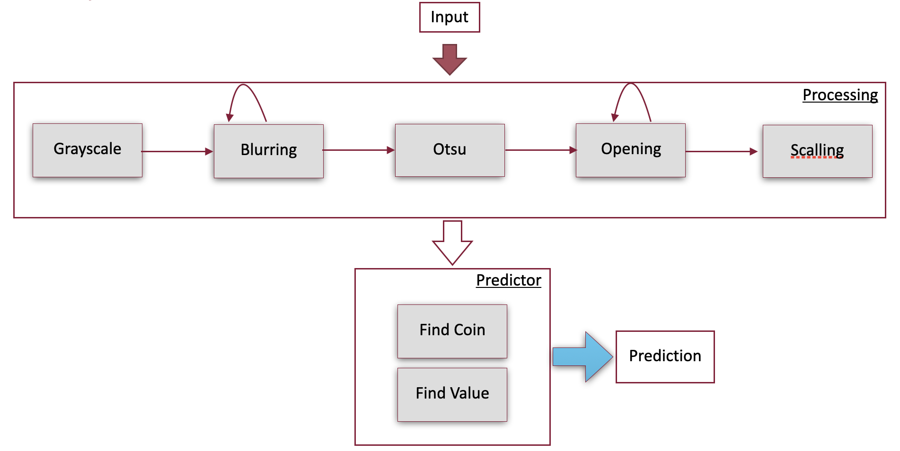

# CoinCounter

The CoinCounter project aims to detect the number of coins and compute the total amount in images using image processing techniques only.

## Overview

The CoinCounter project implements a pipeline for coin detection and amount computation in images. The project consists of the following files:

1. **run.py**: This script runs the CoinCounter pipeline on a set of images.
2. **utils.py**: This script contains utility functions used in the pipeline.
3. **classifier.py**: This file contains the `Classifier` class, which handles evaluation metrics such as Mean Absolute Error (MAE) for the amount and Precision and Recall for coin recognition.
4. **detector.py**: This script contains functions for detecting coins in images.

## Pipeline

The CoinCounter pipeline follows these steps:

1. **Image Preprocessing**: The input image undergoes preprocessing steps, including color space conversion, iterative Gaussian blur, thresholding and scalling.
2. **Coin Detection**: Coins are detected in the preprocessed image using Hough Circle Transform.
3. **Coin Value Estimation**: Detected coins are classified based on their color and size to estimate their values.
4. **Amount Computation**: The total amount of money in the image is computed based on the detected coin values.
5. **Evaluation**: The pipeline evaluates the accuracy of coin detection and amount computation using evaluation metrics.

## Evaluation Metrics

The CoinCounter project evaluates its performance using the following metrics:

- **Mean Absolute Error (MAE)**: Measures the average absolute difference between the true amount and the computed amount for each image.
- **Precision**: Measures the accuracy of coin detection, i.e., the ratio of true positive detections to the total detected coins.
- **Recall**: Measures the completeness of coin detection, i.e., the ratio of true positive detections to the total ground truth coins.

## Result

| Metric             | Value                   |
|--------------------|-------------------------|
| Precision          | 0.9719                  |
| Recall             | 0.5796                  |
| Overall MAE        | 1.5259                  |

